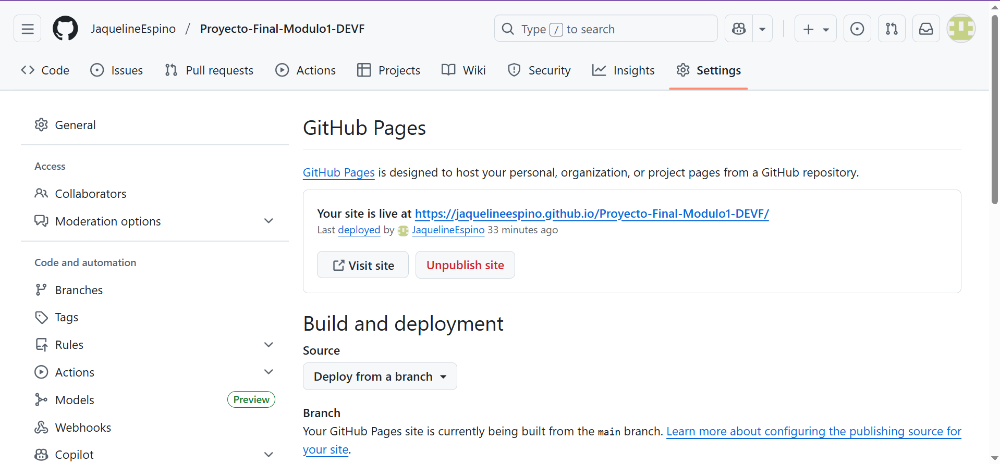
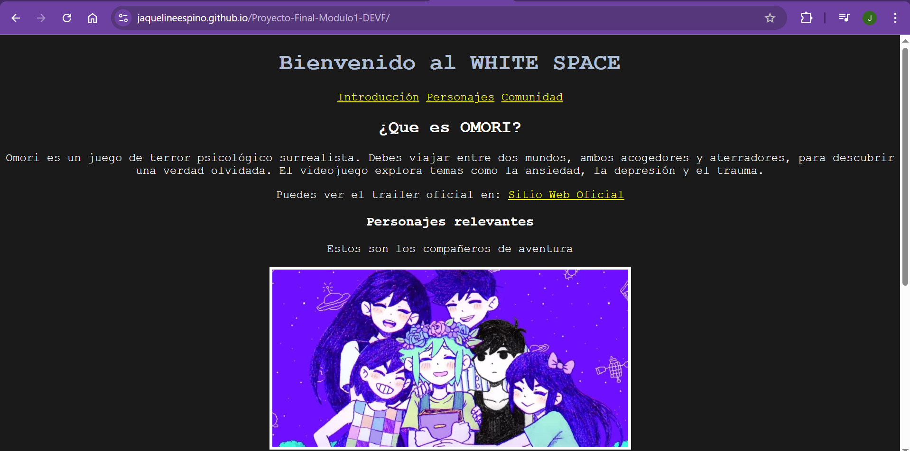
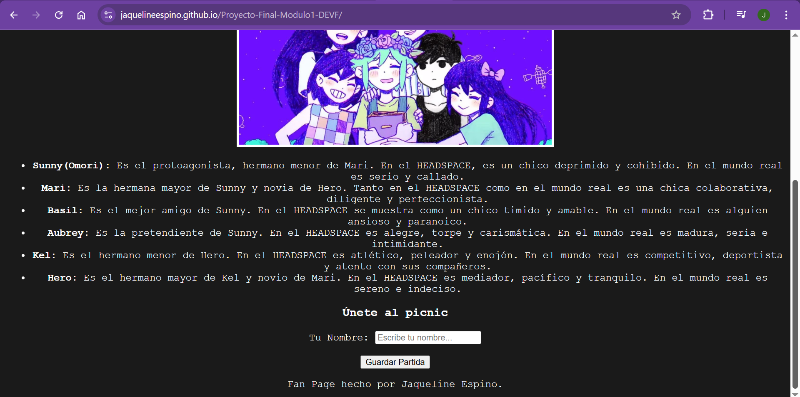

# Evidencias del funcionamiento de la pagina HTML subida en GitHub Pages

## Captura de pantalla de la URL activa en GitHub Pages

## Capturas de pantalla del sitio web abierto en el navegador

## Aprendizajes

**1. ¿Qué fue lo más fácil y lo más retador?**
    Lo más fácil fue utilizar las etiquetas semánticas en html para organizar la página.
    Lo más retador fue utilizar los comandos en Git, ya que aun me parece algo confuso como funciona.

**2. ¿Qué etiquetas semánticas usaste y por qué?**
    Utilicé etiquetas como `<header>`, `<main>`, `<section>` y `<footer>` para dar estructura clara al sitio web, permitiendo entender tanto al navegador ocmo al usuario cual es el contenido principal y cual es la información complementaria.

**3. ¿Cómo organizaste tus commits?**
    Traté de hacer pequeños commits por cada cambio importante, por ejemplo cada vez que agregué una sección o una nueva carpeta.

**4. ¿Qué mejorarías en la siguiente iteración?**
    Me gustaría agregar JavaScript para hacer la página interactiva y más CSS para agregar más estilos y hacer que el sitio web se vea bien en cualquier dispositivo.